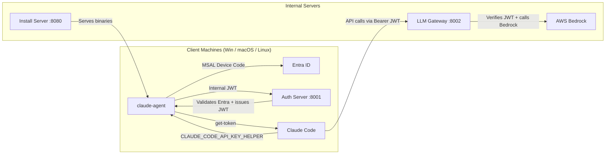

# Claude Code – Internal Deployment (Entra ID + Bedrock Gateway)

> **100 % internal** solution to deploy Claude Code in enterprise environments: SSO authentication via Entra ID, LLM gateway to AWS Bedrock, and multi-OS installation agents.

🇫🇷 *[Version française](README.fr.md)*

---

## Table of Contents

- [Architecture](#architecture)
- [Project Structure](#project-structure)
- [Prerequisites](#prerequisites)
- [Configuration](#configuration)
- [Quick Start (Docker)](#quick-start-docker)
- [Development Setup](#development-setup)
- [Mirroring Claude Code Installers](#mirroring-claude-code-installers)
- [Client Deployment by OS](#client-deployment-by-os)
- [Building Executables (PyInstaller)](#building-executables-pyinstaller)
- [Client Agent Behavior](#client-agent-behavior)
- [Security Considerations](#security-considerations)
- [Deployment Summary](#deployment-summary)
- [License](#license)

---

## Architecture



### Principles

- **No public internet access** required from client machines
- **SSO authentication** via Entra ID (adaptable to Cognito)
- **Bedrock only** through an internal gateway
- **Automatic JWT refresh** every 3h (`CLAUDE_CODE_API_KEY_HELPER` + TTL `10800000 ms`)

---

## Project Structure

```text
claude-code-cli/
├── claude_code_internal/              # Main Python package
│   ├── __init__.py                    # Version 0.1.0
│   ├── config.py                      # Centralized configuration (env vars & constants)
│   ├── logging_config.py              # Structured logging setup
│   ├── client/
│   │   ├── agent.py                   # Multi-OS client agent (install, get-token, refresh-loop, setup-env, uninstall)
│   │   └── installers/
│   │       ├── _base.py               # Shared installer helpers
│   │       ├── windows.py             # Windows scheduled tasks + managed-settings
│   │       ├── macos.py               # macOS LaunchAgents + managed-settings
│   │       └── linux.py               # Linux systemd units + managed-settings
│   ├── servers/
│   │   ├── auth.py                    # Auth server: Entra ID → internal JWT (FastAPI)
│   │   ├── llm_gateway.py            # LLM gateway: JWT → Bedrock invoke (FastAPI)
│   │   └── install_server.py         # Static file server (installers)
│   └── tools/
│       └── mirror_claude_code.py     # Official Claude Code binary mirroring script
├── install_artifacts/                 # Mirrored Claude Code binaries (served by install_server)
├── Dockerfile                         # Multi-service Docker image
├── docker-compose.yml                 # 3-service orchestration
├── pyproject.toml                     # Dependencies + CLI entry points + lint config
├── .env.example                       # Configuration template
└── README.md
```

---

## Prerequisites

| Component | Minimum Version |
|-----------|----------------|
| Python | ≥ 3.9 |
| Poetry | ≥ 1.x |
| Docker + Compose | (optional, for containerized deployment) |
| AWS IAM | Role/key with `bedrock:InvokeModel` |
| Entra ID | App Registration (tenant + client ID) |

---

## Configuration

All configuration is done via **environment variables** (or a `.env` file).

```bash
cp .env.example .env
```

### Key Variables

| Variable | Service | Description |
|----------|---------|-------------|
| `INTERNAL_JWT_SECRET` | Auth + Gateway | Shared secret for signing/verifying internal JWTs (**required**) |
| `ENTRA_TENANT_ID` | Auth | Azure AD tenant ID |
| `ENTRA_CLIENT_ID` | Auth | Entra app registration ID |
| `ENTRA_AUTHORITY` | Auth | Authority override (optional) |
| `INTERNAL_JWT_TTL_HOURS` | Auth | JWT lifetime (default: `3`) |
| `INTERNAL_REFRESH_TTL_DAYS` | Auth | Refresh token lifetime (default: `30`) |
| `BEDROCK_REGION` | Gateway | AWS region (default: `us-east-1`) |
| `BEDROCK_MODEL_ID` | Gateway | Claude model on Bedrock (default: `anthropic.claude-3-5-sonnet-20241022-v1:0`) |
| `ANTHROPIC_VERSION` | Gateway | Anthropic API version (default: `bedrock-2023-05-31`) |
| `AWS_ACCESS_KEY_ID` / `AWS_SECRET_ACCESS_KEY` | Gateway | AWS credentials (or use IAM role/profile) |
| `OPENID_CACHE_TTL_SECONDS` | Auth | OpenID/JWKS cache TTL (default: `3600`) |

---

## Quick Start (Docker)

```bash
# 1. Configure environment
cp .env.example .env
# Edit .env with your actual values

# 2. Start all 3 services
docker compose up --build
```

**Custom ports** (if conflicting):

```bash
AUTH_PORT=18001 GATEWAY_PORT=18002 INSTALL_PORT=18080 docker compose up --build
```

### Exposed Services

| Service | URL | Endpoints |
|---------|-----|-----------|
| Auth | `http://localhost:8001` | `GET /health` · `POST /auth/verify` · `POST /auth/refresh` |
| LLM Gateway | `http://localhost:8002` | `GET /health` · `POST /v1/chat/completions` · `POST /invoke` |
| Install Server | `http://localhost:8080` | `GET /health` · `GET /claude-code/install/{os}/...` |

---

## Development Setup

```bash
# Install Poetry (once)
curl -sSL https://install.python-poetry.org | python3 -

# Install dependencies
poetry install

# Start services individually
poetry run uvicorn claude_code_internal.servers.auth:app --host 0.0.0.0 --port 8001 --reload
poetry run uvicorn claude_code_internal.servers.llm_gateway:app --host 0.0.0.0 --port 8002 --reload
poetry run uvicorn claude_code_internal.servers.install_server:app --host 0.0.0.0 --port 8080 --reload
```

### CLI Entry Points

After `poetry install`, the following commands are available:

```bash
claude-agent install|get-token|refresh-loop|setup-env|uninstall
installer-windows install|uninstall
installer-macos install|uninstall
installer-linux install|uninstall
mirror-claude-code --output DIR [--version X.Y.Z] [--platform PLAT]
```

---

## Mirroring Claude Code Installers

The `mirror_claude_code.py` script fetches official binaries from the public GCS bucket and places them in `install_artifacts/` to be served by the internal install server.

```bash
# From a server with Internet access
poetry run mirror-claude-code --output install_artifacts
```

**Options**:

| Flag | Description |
|------|-------------|
| `--output DIR` | Output directory (default: `install_artifacts`) |
| `--version X.Y.Z` | Specific version (default: `latest`) |
| `--platform PLAT` | Filter by platform (e.g. `--platform win32-x64 --platform darwin-arm64`) |

**Generated tree**:

```text
install_artifacts/
├── windows/
│   ├── win32-x64/claude-code-setup.exe
│   └── claude-code-setup.exe          # Default (copy)
├── macos/
│   ├── darwin-arm64/claude-code-setup.pkg
│   └── claude-code-setup.pkg          # Default (copy)
├── linux/
│   ├── linux-x64/claude-code-setup.run
│   └── claude-code-setup.run          # Default (copy)
└── VERSION
```

---

## Client Deployment by OS

### Windows

```powershell
# 1. Configure URLs (optional if using defaults)
$env:AUTH_SERVER_URL = "https://my-auth-server"
$env:INSTALL_SERVER_URL = "https://my-install-server/claude-code"
$env:LLM_GATEWAY_URL = "https://my-llm-gateway"

# 2. Install
.\claude-agent.exe install

# 3. Set up scheduled tasks + managed-settings
installer-windows install
```

**Effects**:
- Managed settings written to `C:\Program Files\ClaudeCode\managed-settings.json`
- `ClaudeCodeAutoStart` task: launches Claude Code at logon (after `setup-env`)
- `ClaudeCodeTokenRefresh` task: token refresh every 3h

**Uninstall**: `installer-windows uninstall`

---

### macOS

```bash
# 1. Configure
export AUTH_SERVER_URL="https://my-auth-server"
export INSTALL_SERVER_URL="https://my-install-server/claude-code"
export LLM_GATEWAY_URL="https://my-llm-gateway"

# 2. Install
./claude-agent install

# 3. Create LaunchAgents + managed-settings
installer-macos install
```

**Effects**:
- Managed settings at `/Library/Application Support/ClaudeCode/managed-settings.json`
- `com.company.claudecode.autostart.plist`: autostart at login
- `com.company.claudecode.refresh.plist`: refresh every 3h

**Uninstall**: `installer-macos uninstall`

---

### Linux

```bash
# 1. Configure
export AUTH_SERVER_URL="https://my-auth-server"
export INSTALL_SERVER_URL="https://my-install-server/claude-code"
export LLM_GATEWAY_URL="https://my-llm-gateway"

# 2. Install
./claude-agent install

# 3. Create systemd units + managed-settings
installer-linux install
```

**Effects**:
- Managed settings at `/etc/claude-code/managed-settings.json`
- `claudecode-autostart.service`: starts Claude Code with proper env vars
- `claudecode-refresh.service` + `claudecode-refresh.timer`: refresh every 3h

**Uninstall**: `installer-linux uninstall`

---

## Building Executables (PyInstaller)

For deployment without Python on client machines:

```bash
# Client agent (all platforms)
pyinstaller --onefile --name claude-agent claude_code_internal/client/agent.py

# Windows installer (on Windows)
pyinstaller --onefile --name claude-install-win claude_code_internal/client/installers/windows.py

# macOS installer (on macOS)
pyinstaller --onefile --name claude-install-macos claude_code_internal/client/installers/macos.py

# Linux installer (on Linux)
pyinstaller --onefile --name claude-install-linux claude_code_internal/client/installers/linux.py
```

---

## Client Agent Behavior

The agent (`claude_code_internal/client/agent.py`) exposes 5 commands:

| Command | Description |
|---------|-------------|
| `install` | Detects OS & architecture, downloads Claude Code from the internal server, installs it, configures `settings.json`, starts initial Entra ID authentication |
| `get-token` | Checks/refreshes the internal JWT and prints it to `stdout` (used by `CLAUDE_CODE_API_KEY_HELPER`) |
| `refresh-loop` | Infinite loop: refreshes the token 5 min before expiration |
| `setup-env` | Copies the agent to `~/.claude/`, creates helper scripts (`get-token.sh` / `get-token.cmd`), writes `settings.json`, and ensures a valid token |
| `uninstall` | Removes local files (`settings.json`, `token.json`, helpers, agent) |

### Authentication Flow

1. The agent first tries Azure CLI (`az account get-access-token`)
2. Falls back to **MSAL device-code flow** (user opens browser & enters code)
3. Entra token is exchanged for an **internal JWT** via `POST /auth/verify`
4. Internal JWT + refresh token are stored in `~/.claude/token.json`
5. Claude Code calls `CLAUDE_CODE_API_KEY_HELPER` (→ `get-token.sh`/`.cmd`) to retrieve the JWT

---

## Security Considerations

| Item | Recommendation |
|------|---------------|
| `INTERNAL_JWT_SECRET` | Replace with a strong key (env var / vault) — **never keep the default value** |
| Entra ID | Add controls in `auth.py`: required AD group, device compliance, conditional access |
| Bedrock | Adjust `BEDROCK_MODEL_ID`, limit `max_tokens`, log requests |
| TLS | Put a reverse proxy (nginx / ALB) with HTTPS in front of the services |
| Streaming | `/invoke-with-response-stream` is not yet implemented (returns `501`) |

---

## Deployment Summary

1. **Configure & deploy servers**:
   - Auth Server (Entra ID → internal JWT) on port `8001`
   - LLM Gateway (JWT → Bedrock) on port `8002`
   - Install Server (Claude Code binaries) on port `8080`

2. **Mirror installers**:
   ```bash
   poetry run mirror-claude-code --output install_artifacts
   ```

3. **Build executables** (agent + per-OS installers)

4. **Deploy to workstations**:

   | OS | Commands |
   |----|----------|
   | Windows | `claude-agent.exe install` + `installer-windows install` |
   | macOS | `./claude-agent install` + `installer-macos install` |
   | Linux | `./claude-agent install` + `installer-linux install` |

5. **Result**: Claude Code starts automatically with:
   - `CLAUDE_CODE_USE_BEDROCK=1`
   - `CLAUDE_CODE_SKIP_BEDROCK_AUTH=1`
   - `CLAUDE_CODE_API_KEY_HELPER` pointing to the agent
   - Automatic JWT refresh every 3h

---

## License

MIT — see [LICENSE](LICENSE).
