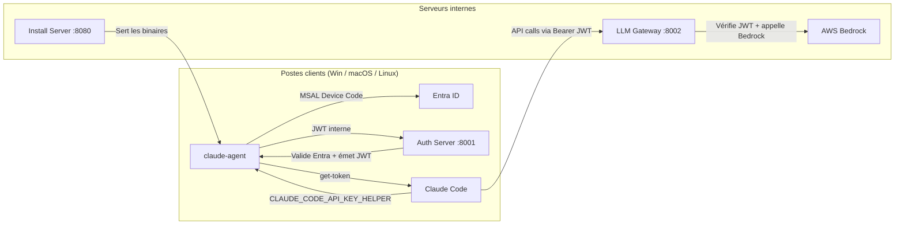

# Claude Code – Installation interne (Entra ID + Bedrock Gateway)

> Solution complète **100 % interne** pour déployer Claude Code en entreprise : authentification SSO via Entra ID, gateway LLM vers AWS Bedrock, et agents d'installation multi-OS.

---

## Table des matières

- [Architecture](#architecture)
- [Structure du projet](#structure-du-projet)
- [Prérequis](#prérequis)
- [Configuration](#configuration)
- [Lancement rapide (Docker)](#lancement-rapide-docker)
- [Lancement en développement](#lancement-en-développement)
- [Mirroring des installateurs Claude Code](#mirroring-des-installateurs-claude-code)
- [Déploiement client par OS](#déploiement-client-par-os)
- [Build des exécutables (PyInstaller)](#build-des-exécutables-pyinstaller)
- [Comportement de l'agent client](#comportement-de-lagent-client)
- [Points à adapter / sécuriser](#points-à-adapter--sécuriser)
- [Résumé rapide du déploiement](#résumé-rapide-du-déploiement)
- [Licence](#licence)

---

## Architecture



### Principes

- **Aucun accès internet public** depuis les postes clients
- **Authentification SSO** via Entra ID (adaptable Cognito)
- **Bedrock uniquement** via un gateway interne
- **Refresh automatique** du JWT toutes les 3h (`CLAUDE_CODE_API_KEY_HELPER` + TTL `10800000 ms`)

---

## Structure du projet

```text
claude-code-cli/
├── claude_code_internal/          # Package Python principal
│   ├── __init__.py                # Version 0.1.0
│   ├── client/
│   │   ├── __init__.py
│   │   ├── agent.py               # Agent client multi-OS (install, get-token, refresh-loop, setup-env, uninstall)
│   │   └── installers/
│   │       ├── __init__.py
│   │       ├── windows.py          # Tâches planifiées Windows + managed-settings
│   │       ├── macos.py            # LaunchAgents macOS + managed-settings
│   │       └── linux.py            # Systemd units Linux + managed-settings
│   ├── servers/
│   │   ├── __init__.py
│   │   ├── auth.py                 # Serveur d'auth : Entra ID → JWT interne (FastAPI)
│   │   ├── llm_gateway.py          # Gateway LLM : JWT → Bedrock invoke (FastAPI)
│   │   └── install_server.py       # Serveur de fichiers statiques (installateurs)
│   └── tools/
│       ├── __init__.py
│       └── mirror_claude_code.py   # Script de mirroring des binaires officiels Claude Code
├── install_artifacts/              # Binaires Claude Code mirrorés (servis par install_server)
├── Dockerfile                      # Image Docker multi-services
├── docker-compose.yml              # Orchestration des 3 services
├── pyproject.toml                  # Dépendances Python (FastAPI, boto3, MSAL, PyJWT…)
├── poetry.lock
├── .env.example                    # Template de configuration
└── README.md
```

---

## Prérequis

| Composant | Version minimale |
|-----------|-----------------|
| Python | ≥ 3.9 |
| Poetry | ≥ 1.x |
| Docker + Compose | (optionnel, pour déploiement conteneurisé) |
| AWS IAM | Rôle/clé avec `bedrock:InvokeModel` |
| Entra ID | App Registration (tenant + client ID) |

---

## Configuration

Toute la configuration se fait via **variables d'environnement** (ou fichier `.env`).

```bash
cp .env.example .env
```

### Variables clés

| Variable | Service | Description |
|----------|---------|-------------|
| `INTERNAL_JWT_SECRET` | Auth + Gateway | Secret partagé pour signer/vérifier les JWT internes (**obligatoire**) |
| `ENTRA_TENANT_ID` | Auth | ID du tenant Azure AD |
| `ENTRA_CLIENT_ID` | Auth | ID de l'app registration Entra |
| `ENTRA_AUTHORITY` | Auth | Override de l'authority (optionnel) |
| `INTERNAL_JWT_TTL_HOURS` | Auth | Durée de vie du JWT (défaut : `3`) |
| `INTERNAL_REFRESH_TTL_DAYS` | Auth | Durée de vie du refresh token (défaut : `30`) |
| `BEDROCK_REGION` | Gateway | Région AWS (défaut : `us-east-1`) |
| `BEDROCK_MODEL_ID` | Gateway | Modèle Claude sur Bedrock (défaut : `anthropic.claude-3-5-sonnet-20241022-v1:0`) |
| `ANTHROPIC_VERSION` | Gateway | Version de l'API Anthropic (défaut : `bedrock-2023-05-31`) |
| `AWS_ACCESS_KEY_ID` / `AWS_SECRET_ACCESS_KEY` | Gateway | Credentials AWS (ou utiliser un rôle IAM / profil) |

---

## Lancement rapide (Docker)

```bash
# 1. Configurer l'environnement
cp .env.example .env
# Éditer .env avec vos valeurs réelles

# 2. Lancer les 3 services
docker compose up --build
```

**Ports personnalisables** (si conflit) :

```bash
AUTH_PORT=18001 GATEWAY_PORT=18002 INSTALL_PORT=18080 docker compose up --build
```

### Services exposés

| Service | URL | Description |
|---------|-----|-------------|
| Auth | `http://localhost:8001` | `POST /auth/verify` · `POST /auth/refresh` |
| LLM Gateway | `http://localhost:8002` | `POST /v1/chat/completions` · `POST /invoke` |
| Install Server | `http://localhost:8080` | `GET /claude-code/install/{os}/...` |

---

## Lancement en développement

```bash
# Installer Poetry (une seule fois)
curl -sSL https://install.python-poetry.org | python3 -

# Installer les dépendances
poetry install

# Lancer les services séparément
poetry run uvicorn claude_code_internal.servers.auth:app --host 0.0.0.0 --port 8001 --reload
poetry run uvicorn claude_code_internal.servers.llm_gateway:app --host 0.0.0.0 --port 8002 --reload
poetry run uvicorn claude_code_internal.servers.install_server:app --host 0.0.0.0 --port 8080 --reload
```

---

## Mirroring des installateurs Claude Code

Le script `mirror_claude_code.py` récupère les binaires officiels depuis le bucket GCS public et les dépose dans `install_artifacts/` pour être servis par le serveur d'install interne.

```bash
# Depuis un serveur avec accès Internet
poetry run python -m claude_code_internal.tools.mirror_claude_code --output install_artifacts
```

**Options** :

| Flag | Description |
|------|-------------|
| `--output DIR` | Dossier de sortie (défaut : `install_artifacts`) |
| `--version X.Y.Z` | Version spécifique (défaut : `latest`) |
| `--platform PLAT` | Filtrer par plateforme (ex : `--platform win32-x64 --platform darwin-arm64`) |

**Arborescence générée** :

```text
install_artifacts/
├── windows/
│   ├── win32-x64/claude-code-setup.exe
│   └── claude-code-setup.exe          # Défaut (copie)
├── macos/
│   ├── darwin-arm64/claude-code-setup.pkg
│   └── claude-code-setup.pkg          # Défaut (copie)
├── linux/
│   ├── linux-x64/claude-code-setup.run
│   └── claude-code-setup.run          # Défaut (copie)
└── VERSION
```

---

## Déploiement client par OS

### Windows

```powershell
# 1. Configurer les URLs (optionnel si valeurs par défaut)
$env:AUTH_SERVER_URL = "https://mon-auth-server"
$env:INSTALL_SERVER_URL = "https://mon-install-server/claude-code"
$env:LLM_GATEWAY_URL = "https://mon-llm-gateway"

# 2. Installer
.\claude-agent.exe install

# 3. Configurer les tâches planifiées + managed-settings
python -m claude_code_internal.client.installers.windows install
```

**Effets** :
- Managed settings écrits dans `C:\Program Files\ClaudeCode\managed-settings.json`
- Tâche `ClaudeCodeAutoStart` : lance Claude Code au logon (après `setup-env`)
- Tâche `ClaudeCodeTokenRefresh` : refresh du token toutes les 3h

**Désinstallation** :

```powershell
python -m claude_code_internal.client.installers.windows uninstall
```

---

### macOS

```bash
# 1. Configurer
export AUTH_SERVER_URL="https://mon-auth-server"
export INSTALL_SERVER_URL="https://mon-install-server/claude-code"
export LLM_GATEWAY_URL="https://mon-llm-gateway"

# 2. Installer
./claude-agent install

# 3. Créer les LaunchAgents + managed-settings
python -m claude_code_internal.client.installers.macos install
```

**Effets** :
- Managed settings dans `/Library/Application Support/ClaudeCode/managed-settings.json`
- LaunchAgent `com.company.claudecode.autostart.plist` : autostart au login
- LaunchAgent `com.company.claudecode.refresh.plist` : refresh toutes les 3h

**Désinstallation** :

```bash
python -m claude_code_internal.client.installers.macos uninstall
```

---

### Linux

```bash
# 1. Configurer
export AUTH_SERVER_URL="https://mon-auth-server"
export INSTALL_SERVER_URL="https://mon-install-server/claude-code"
export LLM_GATEWAY_URL="https://mon-llm-gateway"

# 2. Installer
./claude-agent install

# 3. Créer les units systemd + managed-settings
python -m claude_code_internal.client.installers.linux install
```

**Effets** :
- Managed settings dans `/etc/claude-code/managed-settings.json`
- `claudecode-autostart.service` : lance Claude Code avec les bonnes variables d'env
- `claudecode-refresh.service` + `claudecode-refresh.timer` : refresh toutes les 3h

**Désinstallation** :

```bash
python -m claude_code_internal.client.installers.linux uninstall
```

---

## Build des exécutables (PyInstaller)

Pour un déploiement sans Python sur les postes clients :

```bash
# Agent client (toutes plateformes)
pyinstaller --onefile --name claude-agent claude_code_internal/client/agent.py

# Installateur Windows (sur Windows)
pyinstaller --onefile --name claude-install-win claude_code_internal/client/installers/windows.py

# Installateur macOS (sur macOS)
pyinstaller --onefile --name claude-install-macos claude_code_internal/client/installers/macos.py

# Installateur Linux (sur Linux)
pyinstaller --onefile --name claude-install-linux claude_code_internal/client/installers/linux.py

```

---

## Comportement de l'agent client

L'agent (`claude_code_internal/client/agent.py`) expose 5 commandes :

| Commande | Description |
|----------|-------------|
| `install` | Détecte l'OS et l'architecture, télécharge Claude Code depuis le serveur interne, l'installe, configure `settings.json`, lance la première authentification Entra ID |
| `get-token` | Vérifie/rafraîchit le JWT interne et l'affiche sur `stdout` (utilisé par `CLAUDE_CODE_API_KEY_HELPER`) |
| `refresh-loop` | Boucle infinie : rafraîchit le token 5 min avant expiration |
| `setup-env` | Copie l'agent localement dans `~/.claude/`, crée le helper script (`get-token.sh` / `get-token.cmd`), écrit `settings.json`, et s'assure d'un token valide |
| `uninstall` | Supprime les fichiers locaux (`settings.json`, `token.json`, helpers, agent) |

### Flux d'authentification

1. L'agent tente d'abord Azure CLI (`az account get-access-token`)
2. En fallback, **MSAL device-code flow** (l'utilisateur ouvre un navigateur et entre le code)
3. Le token Entra est échangé contre un **JWT interne** via `POST /auth/verify`
4. Le JWT interne + refresh token sont stockés dans `~/.claude/token.json`
5. Claude Code appelle `CLAUDE_CODE_API_KEY_HELPER` (→ `get-token.sh`/`.cmd`) pour obtenir le JWT

---

## Points à adapter / sécuriser

| Élément | Recommandation |
|---------|---------------|
| `INTERNAL_JWT_SECRET` | Remplacer par une clé forte (env var / vault) – **ne jamais garder la valeur par défaut** |
| Entra ID | Ajouter des contrôles dans `auth.py` : groupe AD obligatoire, device compliance, conditional access |
| Bedrock | Ajuster `BEDROCK_MODEL_ID`, limiter `max_tokens`, loguer les requêtes |
| TLS | Mettre un reverse-proxy (nginx / ALB) en HTTPS devant les services |
| Streaming | L'endpoint `/invoke-with-response-stream` n'est pas encore implémenté (retourne `501`) |

---

## Résumé rapide du déploiement

1. **Configurer & déployer les serveurs** :
   - Auth Server (Entra ID → JWT interne) sur le port `8001`
   - LLM Gateway (JWT → Bedrock) sur le port `8002`
   - Install Server (binaires Claude Code) sur le port `8080`

2. **Mirrorer les installateurs** :
   ```bash
   poetry run python -m claude_code_internal.tools.mirror_claude_code --output install_artifacts
   ```

3. **Builder les exécutables** (agent + installateurs par OS)

4. **Déployer sur les postes** :

   | OS | Commandes |
   |----|-----------|
   | Windows | `claude-agent.exe install` + `claude-install-win.exe install` |
   | macOS | `./claude-agent install` + `./claude-install-macos install` |
   | Linux | `./claude-agent install` + `./claude-install-linux install` |

5. **Résultat** : Claude Code se lance automatiquement avec :
   - `CLAUDE_CODE_USE_BEDROCK=1`
   - `CLAUDE_CODE_SKIP_BEDROCK_AUTH=1`
   - `CLAUDE_CODE_API_KEY_HELPER` pointant sur l'agent
   - Refresh automatique du JWT toutes les 3h

---

## Licence

MIT – voir [LICENSE](LICENSE).
